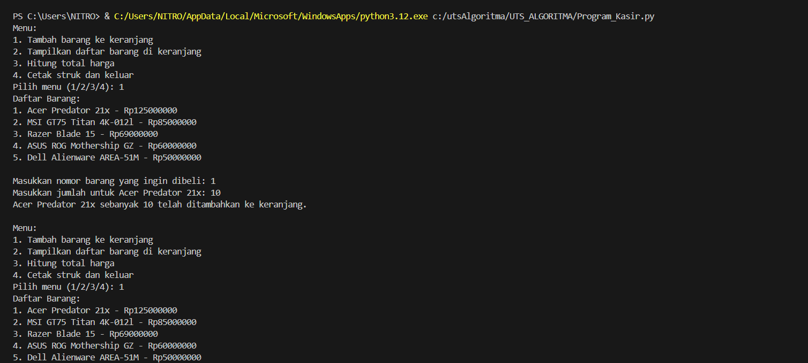

# UTS_ALGORITMA

# Langkah - langkah kerja program :

## Mendefinisikan Daftar Harga Barang :
    -Buat daftar barang beserta harga tetapnya dalam bentuk dictionary bernama daftar_harga. 
    -Setiap barang memiliki nomor, nama, dan harga.

## Inisialisasi Keranjang Belanja :
    -Program memiliki atribut keranjang yang digunakan untuk menyimpan barang-barang yang dipilih pengguna.
    -keranjang berbentuk dictionary yang menyimpan nama barang sebagai kunci, dengan nilai berupa harga dan jumlah barang.

## Menampilkan Daftar Barang (Fungsi tampilkan_daftar_harga) :
    -Fungsi ini menampilkan semua barang yang tersedia dalam daftar_harga dengan format yang mudah dibaca. Setiap barang memiliki nomor, nama, dan harga.
    -Pengguna dapat melihat daftar ini dan memilih barang yang ingin mereka masukkan ke keranjang berdasarkan nomor.

## Menambahkan Barang ke Keranjang (Fungsi tambah_barang) :
    -Setelah daftar harga ditampilkan, pengguna diminta untuk memasukkan nomor barang yang ingin dibeli dan jumlahnya.
    -Program akan memeriksa apakah nomor barang tersebut ada dalam daftar_harga. Jika ya, maka barang akan ditambahkan ke keranjang.
    -Jika barang sudah ada dalam keranjang, maka program hanya akan menambahkan jumlahnya. Jika belum, maka barang akan ditambahkan sebagai item baru.
    -Jika nomor barang yang dimasukkan pengguna tidak ditemukan dalam daftar harga, program akan memberi tahu pengguna bahwa barang tidak valid.

## Menampilkan Isi Keranjang (Fungsi tampilkan_daftar_barang) :
    -Fungsi ini digunakan untuk menampilkan seluruh isi keranjang, mencakup nama barang, jumlah, harga satuan, dan total harga untuk setiap barang.
    -Jika keranjang kosong, program akan memberi tahu bahwa belum ada barang yang ditambahkan.

## Menghitung Total Harga (Fungsi hitung_total_harga) :
    -Fungsi ini menghitung total harga seluruh barang dalam keranjang. Total harga dihitung dengan mengalikan harga satuan setiap barang dengan jumlahnya, lalu menjumlahkan semua total tersebut.
    -Setelah menghitung total, program menampilkan total harga belanja.

## Mencetak Struk Pembelian (Fungsi cetak_struk) :
    -Fungsi ini berfungsi untuk mencetak struk pembelian. Struk menampilkan daftar barang yang dibeli beserta harga dan jumlahnya, diikuti dengan total harga keseluruhan.
    -Setelah mencetak struk, program memberikan pesan penutup dan mengakhiri program.

## Penjelasan Menu Utama Program :
Program memiliki menu utama dengan empat pilihan:
1 untuk menambah barang ke keranjang.
2 untuk menampilkan isi keranjang.
3 untuk menghitung dan menampilkan total harga seluruh barang di keranjang.
4 untuk mencetak struk dan keluar dari program.
Pengguna cukup memilih nomor menu yang sesuai, dan program akan menjalankan fungsi terkait.

## Ringkasan Alur Program :
    1. Pengguna menjalankan program dan melihat menu.
    2. Pengguna memilih menu 1 untuk menambah barang ke keranjang:
        -Program menampilkan daftar barang beserta harga.
        -Pengguna memilih barang berdasarkan nomor dan memasukkan jumlahnya.
        -Barang ditambahkan ke keranjang.
    3. Pengguna dapat memilih menu 2 untuk melihat barang-barang yang telah ditambahkan ke keranjang.
    4. Pengguna dapat memilih menu 3 untuk menghitung total harga dari semua barang yang ada di keranjang.
    5. Saat belanja selesai, pengguna memilih menu 4 untuk mencetak struk dan keluar dari program.

## Bentuk Program :
   

## Hasil Program :
   
   
